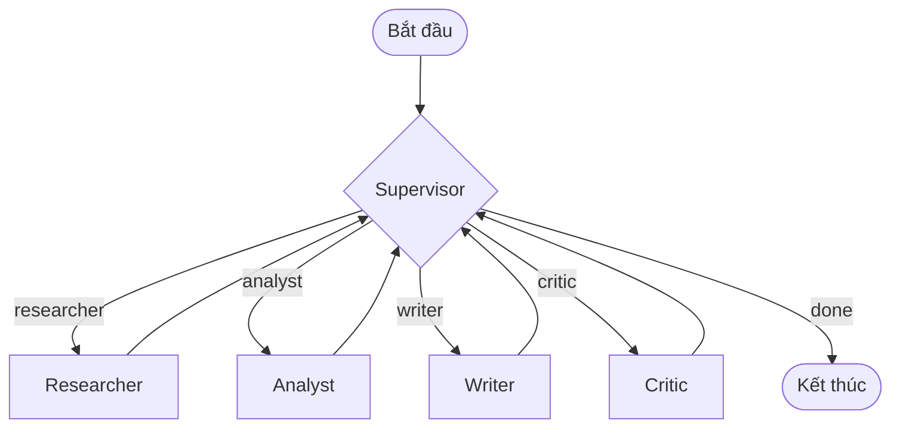

# Tài Liệu Thiết Kế: Hệ Thống Nghiên Cứu Multi-Agent

## Problem

Hệ thống được thiết kế để giải quyết bài toán tự động hóa nghiên cứu và phân tích sâu các chủ đề học thuật hoặc công nghệ phức tạp. Khi nhận được một yêu cầu nghiên cứu của người dùng, hệ thống cần thực hiện tìm kiếm, chọn lọc tài liệu, phân tích claims (khẳng định) kỹ thuật, soạn thảo báo cáo có cấu trúc và kiểm duyệt chất lượng bài viết trước khi đưa ra câu trả lời cuối cùng.

## Why multi-agent?

Mô hình Single-Agent (RAG truyền thống) có những hạn chế lớn sau đối với các tác vụ nghiên cứu chuyên sâu:
1. **Quá tải ngữ cảnh (Context Overload)**: Single-Agent phải gánh vác quá nhiều vai trò (tìm kiếm, phân tích, kiểm duyệt, viết bài) cùng một lúc trong một Context duy nhất, dẫn đến việc bỏ sót chỉ thị (instruction drift) hoặc hallucination (ảo tưởng).
2. **Thiếu khả năng tự sửa lỗi (No self-correction)**: Single-Agent tạo ra câu trả lời trong một lượt chạy duy nhất, không có quy trình đánh giá chéo độc lập từ một Agent phản biện để cải thiện bản thảo.
3. **Phân rã tác vụ (Separation of Concerns)**: Bằng cách chia nhỏ bài toán thành các Agent chuyên biệt (Researcher, Analyst, Writer, Critic) được quản lý bởi một Supervisor, chúng ta có thể tối ưu hóa System Prompt cho từng tác vụ cụ thể và dễ dàng kiểm soát chất lượng ở từng chặng của quy trình.

## Agent roles

| Agent | Responsibility (Trách nhiệm) | Input | Output | Failure mode & Mitigation |
|---|---|---|---|---|
| **Supervisor** | Điều phối toàn bộ quy trình, chọn Agent tiếp theo dựa trên tiến độ và lịch sử xử lý. | `ResearchState` | Tên agent tiếp theo (hoặc `done`) | Chọn sai luồng vô hạn -> Khắc phục bằng cơ chế fallback cố định và `max_iterations`. |
| **Researcher** | Tạo câu truy vấn tìm kiếm tối ưu, gọi API tìm kiếm, và biên dịch tệp ghi chú nghiên cứu thô. | `ResearchState` | `state.sources`, `state.research_notes` | API lỗi hoặc không có khóa -> Khắc phục bằng retry và trình giả lập tìm kiếm bằng LLM. |
| **Analyst** | Phân tích tệp ghi chú nghiên cứu, trích xuất các claims kỹ thuật, tìm kiếm lỗ hổng logic và bằng chứng yếu. | `ResearchState` | `state.analysis_notes` | Bỏ sót claims -> Khắc phục bằng Prompt cấu trúc chặt chẽ yêu cầu đối chiếu. |
| **Writer** | Soạn thảo báo cáo hoàn chỉnh dựa trên ghi chú và phân tích, tích hợp link trích dẫn nguồn inline. | `ResearchState` | `state.final_answer` | Quên trích dẫn -> Khắc phục bằng cách kiểm duyệt của Critic và Writer sửa lại theo feedback. |
| **Critic** | Kiểm duyệt bài viết nháp của Writer đối chiếu với nguồn dữ liệu gốc, quyết định APPROVED hay REJECTED. | `ResearchState` | Phản hồi sửa đổi hoặc chấp thuận | Bắt lỗi quá khắt khe gây lặp luồng -> Khắc phục bằng rào cản tối đa lượt duyệt `max_iterations`. |

## Shared state

Hệ thống sử dụng đối tượng `ResearchState` thừa kế từ `BaseModel` (Pydantic) làm vùng nhớ chung:
- `request` (`ResearchQuery`): Lưu yêu cầu gốc của người dùng (query, max_sources, audience).
- `sources` (`list[SourceDocument]`): Danh sách các tài liệu đã tìm thấy, được chia sẻ giữa Researcher, Writer và Critic.
- `research_notes` (`str`): Ghi chú thu thập thô của Researcher.
- `analysis_notes` (`str`): Phân tích sâu sắc các khẳng định từ Analyst.
- `final_answer` (`str`): Bản thảo/Báo cáo cuối cùng do Writer viết.
- `route_history` (`list[str]`): Lịch sử định tuyến để Supervisor nắm bắt tiến trình và tránh lặp.
- `iteration` (`int`): Bộ đếm số vòng lặp hiện tại để kích hoạt guardrail khi cần.
- `errors` (`list[str]`): Ghi nhận các lỗi phát sinh ở mỗi agent để phục vụ gỡ lỗi.
- `agent_results` (`list[AgentResult]`): Nhật ký kết quả chi tiết của từng agent (gồm tokens, chi phí) để đo lường benchmark.

## Routing policy

Luồng định tuyến được quản lý tập trung bởi **Supervisor Agent** sử dụng mô hình LangGraph dưới dạng một Graph tuần hoàn có điều kiện:

- Lần đầu chạy, Supervisor tự động định tuyến sang **Researcher**.
- Khi Researcher trả về, Supervisor định tuyến sang **Analyst** để bóc tách thông tin.
- Tiếp theo, Supervisor chỉ định **Writer** để soạn thảo báo cáo đầu tiên.
- Bản nháp được chuyển tới **Critic** để kiểm định chất lượng.
- Nếu Critic ghi nhận lỗi, Supervisor định tuyến ngược lại cho **Writer** kèm feedback để cải tiến. Nếu Critic chấp thuận (`APPROVED`), Supervisor dừng luồng (`done`).

## Guardrails

- **Max iterations**: Giới hạn tối đa 6 vòng lặp điều phối. Khi chạm ngưỡng này, Supervisor bắt buộc định tuyến về kết thúc (`done`) để ngăn vòng lặp vô hạn.
- **Timeout**: Áp dụng thời gian chờ tối đa cho các request gọi API mạng.
- **Retry**: Sử dụng thư viện `tenacity` tự động retry với Exponential Backoff khi API của OpenAI hoặc Tavily bị lỗi kết nối hoặc mã lỗi HTTP 429.
- **Fallback**: Thiết lập danh sách định tuyến mặc định (`researcher` -> `analyst` -> `writer` -> `critic` -> `done`) nếu kết quả phân tích JSON của Supervisor bị hỏng hoặc không hợp lệ.
- **Validation**: Kiểm tra tính hợp lệ của định dạng JSON trước khi thực hiện parse dữ liệu trả về từ LLM.

## Benchmark plan

- **Queries**: Thử nghiệm với các câu hỏi nghiên cứu kỹ thuật phức tạp cần thu thập đa chiều (ví dụ: *"Explain GraphRAG state-of-the-art architectures and its comparison with vector-search RAG"*).
- **Metrics**: Đo lường Latency (giây), Estimated Cost (USD), LLM Quality Score (0.0 - 10.0), Citation Coverage (0.0 - 1.0) và Error Rate.
- **Expected outcome**: Hệ thống Multi-Agent có thể tốn thời gian chạy lâu hơn và chi phí cao hơn, nhưng sẽ đạt được chất lượng bài viết sâu sắc hơn, độ phủ thông tin tốt hơn và tỷ lệ lỗi sai sự thật (hallucination) thấp hơn nhờ có các bước phân tích chéo và phê duyệt của Critic.
